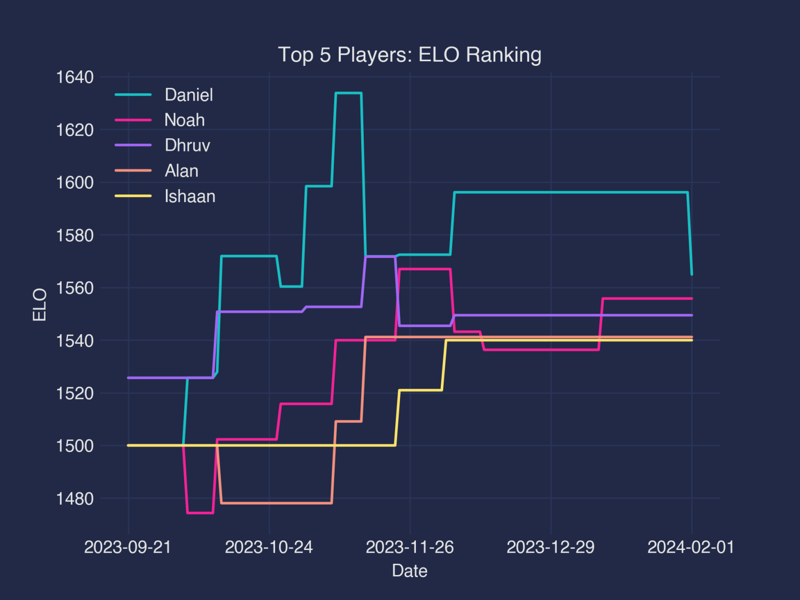

# Shogi Club Discord Bot
Discord bot for the Homestead High School Shogi Club.  
Tracks games played by members and stats of every member (e.g. Elo, K/D, win rate, number of games played).
Uses Discord's Python API.  
Stores data in 3 csv files (`games.csv`, `players.csv`, and `player_history.csv`) in the `data` folder.  
Command prefix is set to `?`.  
## Commands/Features (for members):
### Ranking: `?ranking ["elo", "kd", "rate", "game"] [n]`   
Ranks the top number `n` players by one of the criterias passed in. (`n` is 10 by default.)  

`elo`: Ranks by Elo of player.  
`kd`: Ranks by Kills/Deaths of player (includes unranked).  
`rate`: Ranks by percentage of games won by player (includes unranked).  
`games`: Ranks by number of games played by player (includes unranked).  

**Example:**  
**User:** `?ranking elo 5`  
**Bot:**
```
Rank:      Name:       ELO:
    1     Daniel     1564.9
    2       Noah     1555.8
    3      Dhruv     1549.4
    4       Alan     1541.2
    5     Ishaan     1539.9
```  
### Matchup: `?matchup [name1] [name2]`   
Returns the expected log likelihood of a shogi match between `name1` and `name2` based on their Elo. Returns percentage chance of winning, current Elo, and change to Elo based on a win or loss.

**Example:**  
**User:** `?matchup Daniel Alan`  
**Bot:**
```
          Matchup          
Daniel       v         Alan
Win%: 53.4       Win%: 46.6
ELO: 1564.9     ELO: 1541.2
Win∆: 22.6       Win∆: 26.4
Loss∆: -25.9   Loss∆: -23.0
```  

### Graph: `?graph ["elo", "kd", "rate", "game"] [n]`   
Similar to `?ranking` but graphs the historical stats of the top number `n` players by one of the criterias passed in. (`n` is 5 by default.)  

**Example:**  
**User:** `?graph elo 5`  
**Bot:**  
 
### History: `?history [n]`   
Lists the past `n` games played in Shogi Club. Gives the two players' names, date played, outcome of the game, and the game mode (ranked or unranked). (`n` is 10 by default)

**Example:**  
**User:** `?history`  
**Bot:**
```
#   Games:    
99  2024-02-01  Rishabh - W   Daniel - L     R
98  2024-02-01     Alan - D     Noah - D     R
97  2024-02-01   Nathan - D    Dylan - D     R
96  2024-02-01   Sophia - W   Simran - L     R
95  2024-01-18   Nathan - D    Rohan - D     R
94  2024-01-18    Ethan - D     Elad - D     R
93  2024-01-18   Daniel - D    Dhruv - D     U
92  2024-01-18 Kartikey - W     Arsh - L     R
91  2024-01-11    Dhruv - W    Ethan - L     U
90  2024-01-11     Noah - W   Nathan - L     U
```  
### Game: `?game [n]`   
Provides information on game number `n`. Gives information such as the date, name of the two players, outcome, game mode, initial expectations on who would win, initial Elo, change in Elo, and any additional comments. (`n` defaults to the most recent game.)

**Example:**  
**User:** `?game 80`  
**Bot:**
```
Game #80          2023-12-14
Names:      Nathan      Noah
Result:          W         L
Expected:     39.2      60.8
ELO:        1489.7    1565.7
∆ELO:         31.5     -29.4
Comments: nan
```  
### Profile: `?profile [name]`   
Shows detailed information on `name` (a player's first/nick name). Lists their full name, games won, lost, drawn, total, Elo, K/D, and win rate.  

**Example:**  
**User:** `?profile Daniel`  
**Bot:**
```
Daniel (Daniel Matsui Smola)

Won: 19   Lost: 7   Draw: 7   Total: 33

ELO:     1564.9
K/D:       2.71
Win%:       0.6
```  
### Members: `?members [full_name]`   
Lists the names of all members in the club. Displays only first names by default but could pass on additional argument `true` to display full names.

**Example:**  
**User:** `?members`  
**Bot:**
```
Name:
    Daniel
     Eddie
     Dylan
     [...]
(26 lines hidden)
     [...]
      Noah
      Leah
      Arsh
```  
## Commands/Features (for server owners):
**All the following commands check whether the user is the server owner.**
### Begin/End Update: `?update ["begin", "save"]`   
Begins or ends update process. Cannot make changes unless  update process is begun and changes are not saved unless the update process is saved.  

**Example:**  
**User:** `?update begin`  
**Bot:**
```
ShogiClub ready to update scores.
```  
**User:** `?update save`  
**Bot:**
```
ShogiClub scores updated and saved.
```  
### Roll back changes: `?rollback [n]`   
Rolls back changes made during update to the log state index number `n`. Change logs can be viewed with command `?logs`. (`n` is set to -2 by default which rolls back the most recent change.)

**Example:**  
**User:** `?rollback 0`  
**Bot:**
```
Changes rolled back to Log number 0.
```  
### View Change Logs: `?logs`   
Shows the log history of changes during the update session with the change index.

**Example:**  
**User:** `?logs`  
**Bot:**
```
Change Log:
  0: Beginning state
  1: Added game Dhruv, Elad
  2: Added game Noah, Ethan
  3: Added game Daniel, Noah
```  
### Add Game: `?add [name1] [name2] [game mode] ["W", "L", "D"] [comments] [date]`   
Adds a game played between `name1` and `name2`.  
If these players do not exist yet in the member list, they must be added.  
`game mode` typically indicates `R` for ranked for `U` for unranked.  
`["W", "L", "D"]` indicates whether `name1` won, lost, or drawn during the match.  
`comments` are just comments regarding the game. Keep them blank with a `""` if nothing to say.  
The date is `yyyy-mm-dd` but defaults to current day so could be left blank.  

**Example:**  
**User:** `?add Daniel Noah R D "5-5. I was winning fr" 2024-02-08`  
**Bot:**
```
Game mode: R
Daniel draw: ELO Change: 1564.8933407290097, New ELO: 0
Noah draw: ELO Change: 1555.7545053129618, New ELO: 0
```  
### Push to History: `?push [date]`   
Pushes current scores to player history. Date is current date by default. Could set manually with `yyyy-mm-dd`.

**Example:**  
**User:** `?push 2024-02-01`  
**Bot:**
```
Pushed data to player history.
```  
### Add Player: `?add_player [full_name] [start_elo]`   
Adds a new player to the member list and creates a nick name for them. `start_elo` is optional but is set to 1100 by default. 

**Example:**  
**User:** `?add_player "Kartikey Sharma" 1000`  
**Bot:**
```
Player Kartikey added with 1000 ELO.
```  
### Re-calculate Stats: `?rerun_calculations`   
Re-plays all the games in history and recalculates all the player's scores. Useful when you rework how much Elo is rewarded. Scores are pushed as new entries in player history for every date. You should run `?clear_players` first to begin with a clean slate. 

**Example:**  
**User:** `?rerun_calculations`  
**Bot:**
```
Rerun Calculations on Player Data
```  
### Clear Player Data: `?clear_players`   
Clears player data to some initial reset state set by csv files in the `data` folder. You run this to start with a clean slate to run Re-calculate stats on.  
If you run this and save the update without `?rerun_calculations`, your player data and player_history data will be lost. Your games data will not be lost.

**Example:**  
**User:** `?clear_players`  
**Bot:**
```
Cleared Player Data
```  